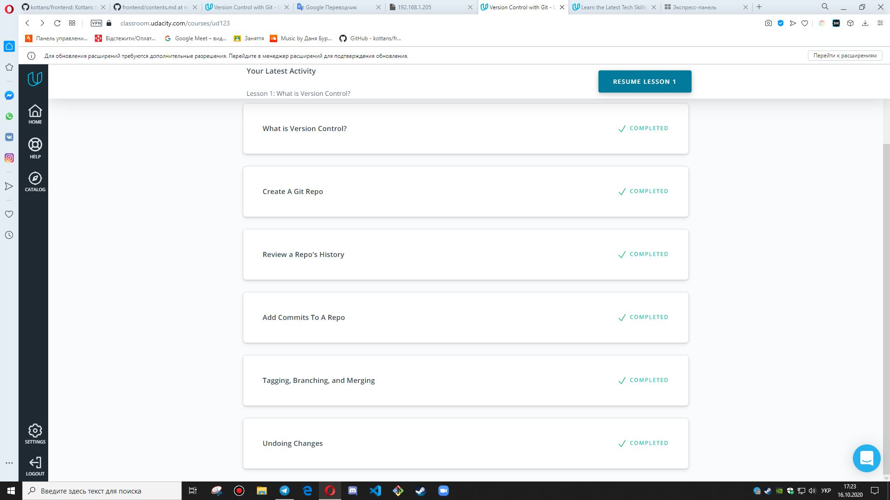
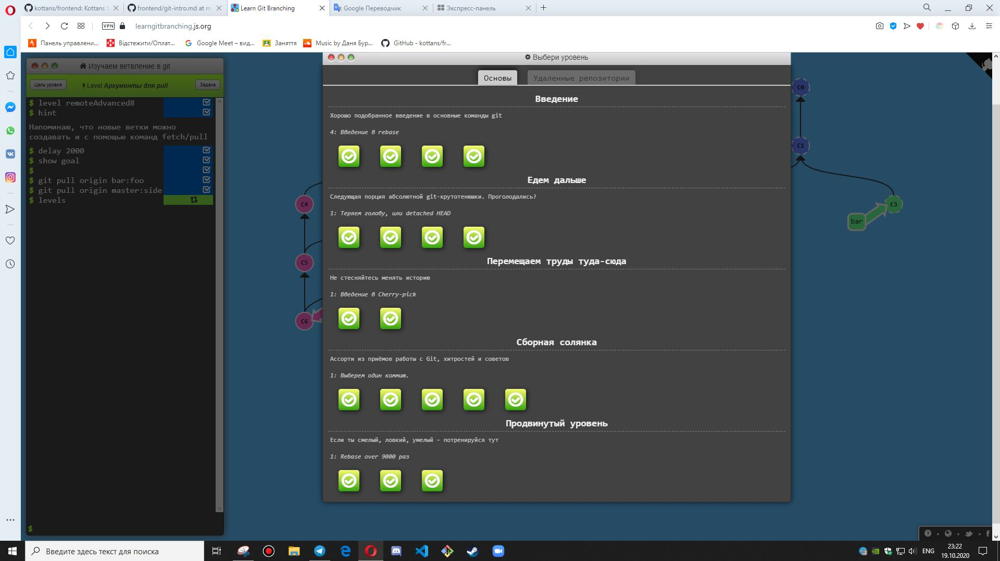
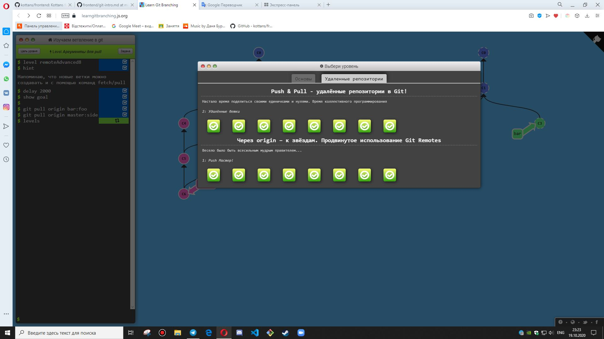
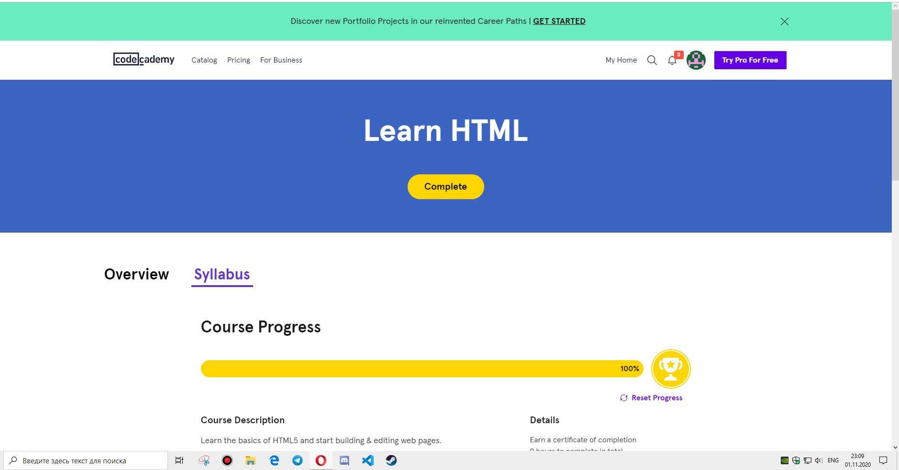
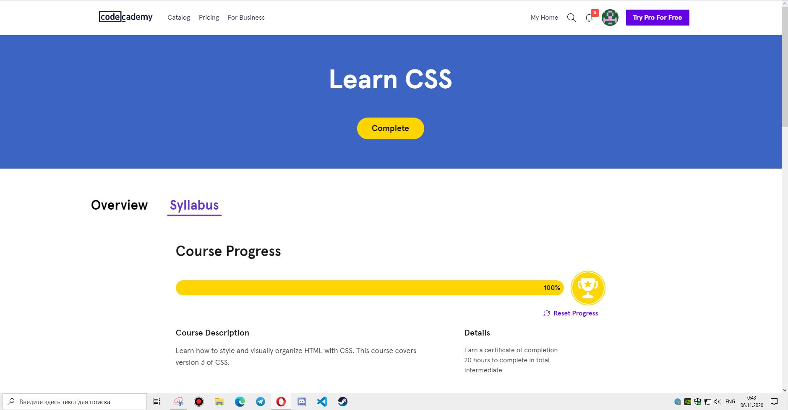
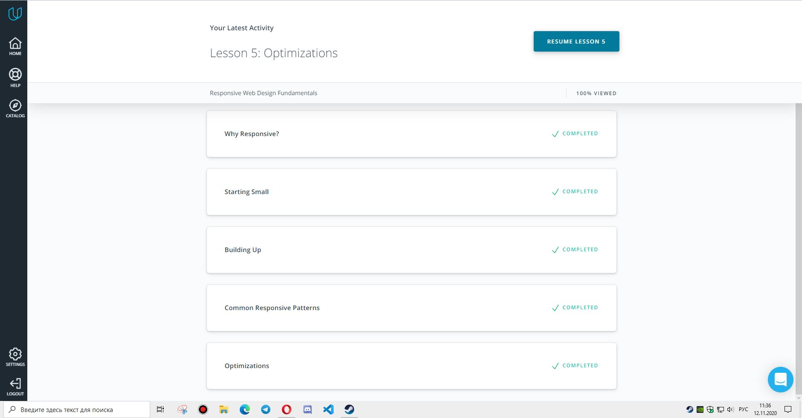
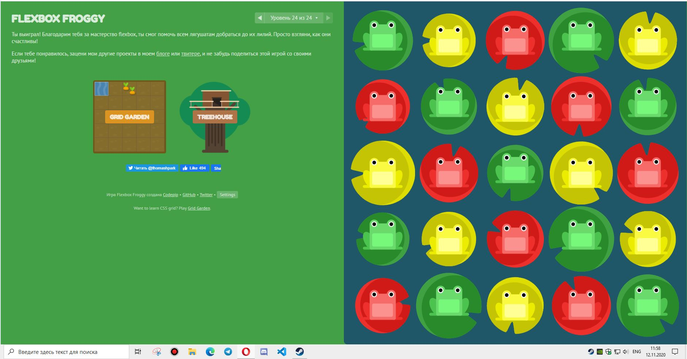

# kottans-frontend
# General
-  [x] Git Basics
-  [x] Linux CLI and Networking
-  [x] VCS (hello gitty), GitHub and Collaboration

# Front-End Basics
-  [x] Intro to HTML & CSS 
-  [x] Responsive Web Design
-  [x] HTML & CSS Practice
-  [ ] JavaScript Basics

## Git Basics 

## Version Control with Git 

- Before I started this course, I had no knowledge about Git. 
- But know, when I finished course aboute Git 
  I have some knowledge and I can use Git for my needs.
- In this course everything was new for me,differents commands and flags and etc, because I just started learning Git. 
- I liked the material because it was normal for learning. I think this material are useful and necessary.

## Learn Git Branching 

- When I started this course I improved my knowledge about Git Branching.
- The most memorable command was ___"git fakeTeamwork"___ because for my opinion it was useful command.
- In future I will be able to use branches flexibly.

## Linux CLI, and HTTP

  

  Screenshots"Linux Survival"
  

WOW, I finished one more course and I learned some information about Linux and Linux commands. 
It was my first experience with Linux, but it was not difficult.
In this course everything was new and interesting for me because I use Windows:) But maybe in future I will install Linux and will use it. And I will use my Linux skills.  

After completing course "Linux Survival" I learned and understood:
- How create a directory (mkdir)
- how change directory  (cd)
- how copy file (cp)
- how remove file (rm)
- how find file (find) 

## Git Collaboration

  

  Screenshots"Git Collaboration"
  

So, I finished one more course and I learned more information about Git,GitHub and about Git branching.

__What was new to me__:

- How works with GitHub;
- how create a pull requests;
- how working with remote repo with: __git fetch__, __git push__ and __git pull__;
- how squash commits __git rebase -i__;
- how working on Another Developer's Repository;
- how forking repo;
- and etc;
 
__What surprised me__: 

- Is what I can filter commits;

## Intro to HTML and CSS

  

Screenshots"Intro to HTML and CSS"
  

  

  
  So, I finished one more course and I learned more information about Html and Css.After this courses I improved my knowledge about semantic HTML and CSS grid.
  Some information was new for me:

  

A lot of html tags:
  

figcaption - defines a caption for a figure element.

figure - specifies self-contained content, like illustrations, diagrams, photos, code listings, etc.

main - specifies the main content of a document.

mark - defines text that should be marked or highlighted.

section - defines a section in a document.

time - defines a specific time.

video - is used to embed video content in a document, such as a movie clip or other video streams.

audio - is used to embed sound content in a document, such as music or other audio streams.

source - is used to specify multiple media resources for media elements.

datalist - specifies a list of pre-defined options for an input element.

select - is used to create a drop-down list.

optgroup - is used to group related options in a select element (drop-down list).

dl - defines a description list.

dt - defines a term/name in a description list.

dd - is used to describe a term/name in a description list.

And etc.

- __What's new for me from the course about CSS:__

Everything about the grids and transitions and a lot of selectors.

- __What's new for me from the course about HTML:__
  
Everything about Tables, Forms and some Semantic  HTML and etc.

## Responsive Web Design

  

  Screenshots"Responsive Web Design"
  

  

  

Wow I finished one more course  and I feel that my skills have improved.

### __Udacity Responsive Web Design:__
- What targets should be 48px x 48px;
- how add a media queries, breakpoints;
- the normal line heigth for body text is 65 characters per line;
- how to set up a testing suite using a combination of physical devices,simulators and emulators;
- setting the viewport  __<meta name="viewport" content="width"=device-width,initial-scale="1.0">__
### __Flex Froggy__
  I played Flex Froggy before this course, but I finished one more time and refreshed my knowledge about flexbox.

## __HTML & CSS practice__
Wow! I do this! I used to create dropdown menu using only css and html. It's my first experiense. And when I finished this task, I feels look my skills in Front-End much better. 
- [Demo](https://DaniaB24.github.io.)

